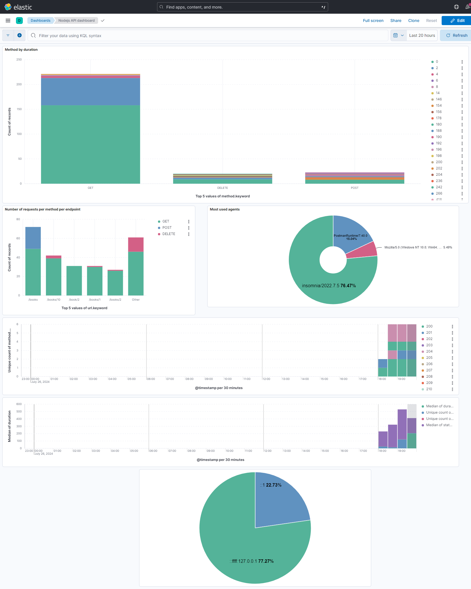

# devops-class-tp
## This is a simple node api for library with SQLite
### deployment
```node
$ npm install
```
### Run with
```node
$ npm start
```
### Run linter
```node
$ npm run lint
```
### Run Tests
```node
$ npm run test
```
Now the project is availlable on http://localhost:4200

### List of endpoints

- List books: GET => http://localhost:4200/books
- Create book: POST => http://localhost:4200/books with title and author field as json
- get single book: GET => http://localhost:4200/books/{id}
- Delete book: DELETE => http://localhost:4200/books/{id}
 
